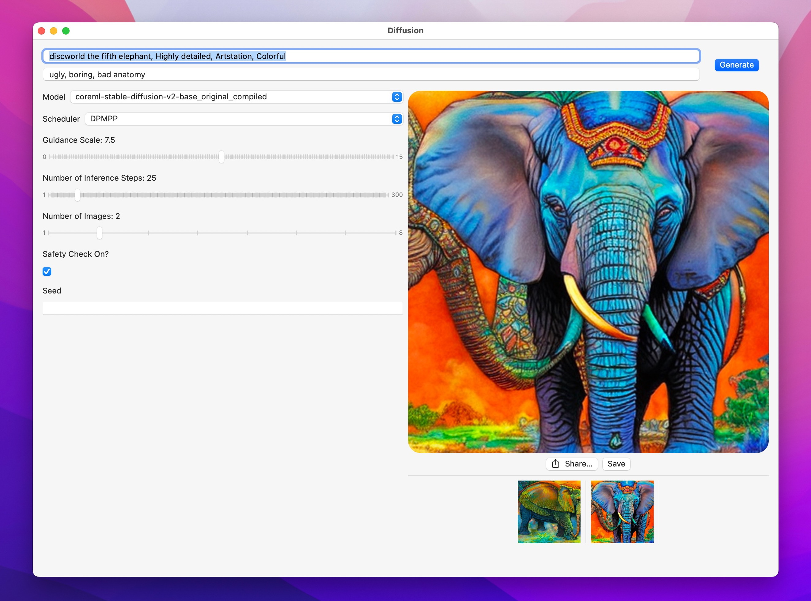

#  Diffusion

This is a simple app that shows how to integrate Apple's [Core ML Stable Diffusion implementation](https://github.com/apple/ml-stable-diffusion) in a native Swift UI application. It can be used for faster iteration, or as sample code for other use cases.

This is what it looks like:

On first launch, the application downloads a zipped archive with a Core ML version of Runway's Stable Diffusion v1.5, from [this location in the Hugging Face Hub](https://huggingface.co/pcuenq/coreml-stable-diffusion/tree/main). This process takes a while, as several GB of data have to be downloaded and unarchived.

For faster inference, we use a very fast scheduler: [DPM-Solver++](https://github.com/LuChengTHU/dpm-solver) that we ported to Swift. Since this scheduler is still not available in Apple's GitHub repository, the application depends on the following fork instead: https://github.com/pcuenca/ml-stable-diffusion. Our Swift port is based on [Diffusers' DPMSolverMultistepScheduler](https://github.com/huggingface/diffusers/blob/main/src/diffusers/schedulers/scheduling_dpmsolver_multistep.py), with a number of simplifications.

## Installing

The Xcode project uses xcconfig files to implement code signing so that anybody can use the project without having to set up code signing again (except for the first time). You just need to make a copy of the `Sign-Debug-template.xcconfig` and `Sign-Release-template.xcconfig` files and name them `Sign-Debug.xcconfig` and `Sign-Release.xcconfig` respectively.

You then need to create two manual provisioning profiles (Xcode will not accept automatically created profiles for this purpose) and insert the relevant values from them into the newly created files. You also need to set your own bundle identier (for the `PRODUCT_BUNDLE_IDENTIFIER` key) to the file so that code signing will let you use your own bundle ID.

(I will add more detailed documentation here as to how to do all of this when I have a bit of time but a little bit of Googling should show you how to create a manual provisioning profile and to get the values from the provisioing profile you created 🙂)

## Compatibility

- macOS Ventura 13.1, iOS/iPadOS 16.2, Xcode 14.2.
- Performance (after initial generation, which is slower)
  * ~10s in macOS on MacBook Pro M1 Max (64 GB).
  * ~2 minutes in iPhone 13 Pro.

## Limitations

- The UI does not expose a way to configure the scheduler, number of inference steps, or generation seed. These are all available in the underlying code.
- A single model (Stable Diffusion v1.5) is considered. The Core ML compute units have been hardcoded to CPU and GPU, since that's what gives best results on my Mac (M1 Max MacBook Pro).
- Sometimes generation returns a `nil` image. This needs to be investigated.

## Next Steps

- ~~Improve UI. Allow the user to select generation parameters.~~
- ~~Implement negative prompts.~~
- Implement other interesting schedulers.
- Allow other models to run. Provide a recommended "compute units" configuration based on model and platform.
- Explore other features (image to image, for example).
